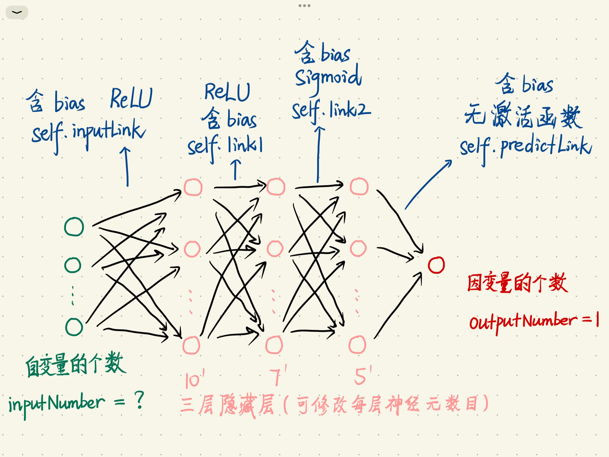

[TOC]

------

------

## 下载

1. 浏览器输入：https://minhaskamal.github.io/DownGit
2. 打开后输入：https://github.com/Illusionna/Codes/tree/main/Python/BP
3. 点击 Download 按钮.

------

------

## 简介

这是一个简单的 BP 神经网络，可用于**<u>回归预测</u>**，架构如下：



------

------

## 环境

- Windows & Linux
- Anaconda 虚拟环境解释器，建议 Python 版本 3.8 以上
- 如若电脑有 NVIDIA 图像处理显卡，使用 CUDA 程序将提速.
- Install packages as follows:
  - numpy
  - pandas
  - tqdm
  - matplotlib
  - torch（可能和 numpy 存在依赖）
  - platform

------

------

## 示范

#### demo.xlsx

$$
f(x)=x^2+\sin(3x)\ \ \ \ \ \ \color[rgb]{1,0,0}x\in[-2.5,\ 2.5]
$$

优化器：SGD.

损失函数：MSE.

<video src="./stream/demo.mp4">

#### BostonHousing.txt

[波士顿房价数据集链接](https://archive.ics.uci.edu/ml/machine-learning-databases/housing/housing.data)

数据集划分：提供 bootsrap 和 hierarchical 抽样.

```python
lor = LOADER(io='./Data/BostonHousing.xlsx')

SHUFFLE(
    data = lor.data,
    labels = lor.labels,
    attribute = lor.attribute
).Shuffle(rule='bootsrap')
```

优化器：Adam.

损失函数：MSE.

<video src="./stream/train_predict.mp4">

------

------

## Push

Done.

