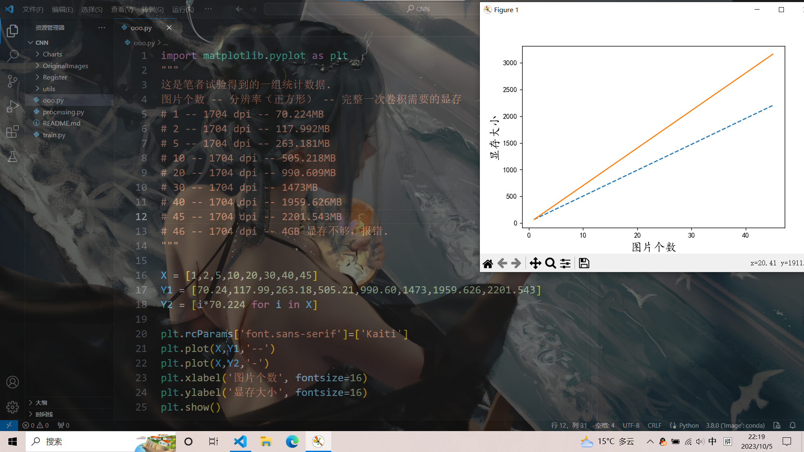

[TOC]

# 写在最前面

建议使用 Typora 软件阅读 .md 文件，可在其官网下载.

# 简介

这是一个 CNN 灰度图片卷积神经网络代码，可用于彩色（灰度）图片集的多分类任务，于 2023 年国庆期间完结.

# 下载

1. 浏览器输入：https://minhaskamal.github.io/DownGit
2. 打开后输入：https://github.com/Illusionna/Codes/tree/main/Python/CNN
3. 点击 Download 按钮.

# 架构

```python
# 正常输入一张 RGB 三通道正方形（processing.py 文件可方阵化图片）图片，像素分辨率 NxN dpi.
self.conv1 = torch.nn.Sequential(
    torch.nn.Conv2d(
        in_channels = 1,	# 希望 conv1 卷积核输入 1 通道.
        out_channels = 16,	# 希望 conv1 卷积后输出 16 通道.
        kernel_size = (5, 5),	# 卷积核大小 5x5 dpi.
        stride = 3,			# 滑动步长 3 dpi.
        padding = 3			# 卷积结束后给方形图片四周各填充 3 dpi.
    ),
    torch.nn.ReLU(),		# 通过 ReLU( ) 激活函数.
    torch.nn.MaxPool2d(kernel_size=2)	# 通过 MaxPool2d( ) 池化层，且池化核大小 2x2 dpi.
)
self.conv2 = torch.nn.Sequential(
    torch.nn.Conv2d(
        in_channels = 16,
        out_channels = 32,
        kernel_size = (5, 5),
        stride = 2,
        padding = 2
    ),
    # torch.nn.Sigmoid(),
    torch.nn.AvgPool2d(kernel_size=3)
)
self.conv3 = torch.nn.Sequential(
    torch.nn.Conv2d(
        in_channels = 32,
        out_channels = 8,
        kernel_size = (3, 3),
        stride = 1,
        padding = 1
    ),
    # torch.nn.ReLU(),
    torch.nn.MaxPool2d(kernel_size=2)
)
self.output = torch.nn.Linear(
    # 暂时不用确定最后输出的参数个数.
    # 探查兵函数函数会自动检测，哨兵函数 Sentry( ) 函数会守护该参数 parameters.
    in_features = parameters,
    out_features = self.softmax	# 起源图片集 OriginalImages 类别个数.
)
```

# 环境

#### 文本编辑集成环境：

Windows: VSCode Version 1.83.0

Linux: 待调试....

Mac: 自己没苹果电脑，用的是别人电脑，不过在苹果终端黑框框内也能执行.

#### Anaconda 大蟒蛇（Miniconda 迷你蟒蛇）虚拟环境 Python 蟒蛇解释器：

```
conda activate -n Chart python==3.8.0
```

#### processing.py 依赖库：

```
pip install -i https://pypi.tuna.tsinghua.edu.cn/simple pandas
```

```
pip install -i https://pypi.tuna.tsinghua.edu.cn/simple pillow
```

```
pip install openpyxl
```

#### train.py 依赖库：

```
pip install -i https://pypi.tuna.tsinghua.edu.cn/simple torch
CPU 和 GPU 两种版本，根据自己电脑情况，自行百度解决.
笔者使用代码逻辑倾向于 GPU 版本，不过 CPU 也能执行.
```

```
pip install -i https://pypi.tuna.tsinghua.edu.cn/simple tqdm
```

```
pip install -i https://pypi.tuna.tsinghua.edu.cn/simple psutil
```

#### predict.py 依赖库：

```
无.
```

# 使用

#### step1

对起源图片集 "./OriginalImages" 文件夹图片进行处理，结果图片自动保存至 "./utils/charts" 文件夹（不必创建）下，其余重要文件统一自动保存至 "./utils/register" 寄存器文件夹（不必创建）下.

```
python processing.py
```

#### step2

训练图片集，categoryNumber、iteration、learningRate 是超参数，可调整，其余实参不要改动.

```python
block = eval(open('./utils/register/block.txt', mode='r').readline())
obj = TRAIN(
    model = CNN(dpi = block),
    categoryNumber = 6,		# 起源图片集的类别个数.
    iteration = 1200,
    learningRate = 0.001,
    chartsPath = './utils/charts',
)
```

```
python train.py
```

#### step3

验证训练效果，验证集下载链接：https://gitee.com/Illusionna/OnlineSharing/raw/master/CNN_Validations.zip

选择好想要验证的图片，以及选择训练结束后产生的权重文件，即可预测.

```
python predict.py
```

# 注意

- 建议使用 CUDA 图形处理器，程序大幅度提速.
- 注意**<u>根目录工作区的相对位置</u>**.
- "./utils" 文件夹**<u>核心文件夹</u>**是 "./utils/Net" 和 "./utils/Processing" 其余运行程序自动产生的文件夹可以删除.
- 主函数接口：processing.py、train.py、predict.py.
- 由于网络简陋和图片集匮乏，谅解预测结果的“波粒二象性”、不准确性和“指鹿为马性”.

# 预处理类介绍

- REVISE（不影响起源图片集文件夹）
  - REVISE.Rename( ) 图片重命名.
  - REVISE.Encode( ) 图片重编码.
- RESIZE 图片方阵化.

# ./utils/Net/TRAINING.py 受保护字典预设介绍

```python
_defaults = {
    # 小数点后左对齐补全宽度（可不必修改）.
    'width' : 3,
    # 显示 Loss 小数点后精度（可不必修改）.
    'degree' : 7,
    # 进度条栏数（可不必修改）.
    'column' : 150,
    # 图形处理器设备 CUDA 训练使用显存比例.
    # 根据如下少量试验结果图表明，将 GPU 一半显存用于训练消耗即可.
    # 如果 0.5 的比例电脑依然够呛，可以调得更小.
    'GPU_UsingRatio' : 0.5,
    # 控制 CPU 处理器上一组含图片个数.
    # 即传说中的 BATCH_SIZE，考虑速度和内存有限，每次选取若干张图片为一组进行训练.
    # 如果电脑性能差，可降低该值，笔者电脑总内存 16GB，空闲内存约 11GB，因此设置 20 张图片.
    'CPU_GROUP_CONTROL' : 20
}
```



# 写作后面

理论知识后续有时间再更新，预计会整理成 .pdf 文件，笔者最近打算先摆烂一段时间.