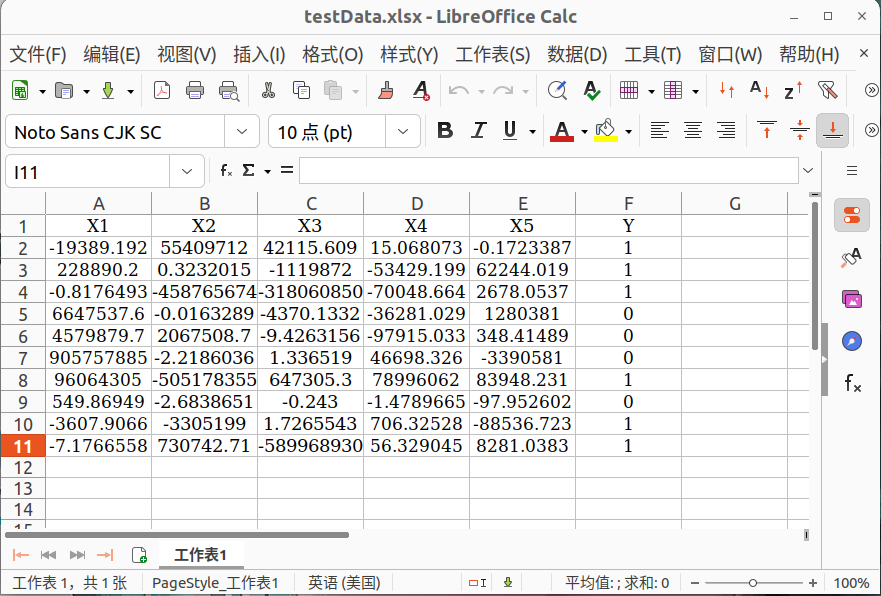

## 目标：

​	获得某个聚类方法（K-means，GMM，SOM）下某张表格（Australia，German，Japan）的内在指数（DBI，DI），并保存指数结果和聚类标签结果. 
$$
\color[rgb]{1,0,1}\bf\fbox{最优聚类数目需要跑数据，我的电脑内存不够，跑不动，所以无法进行下去.}
$$


## 数据要求：

- [x] 统一成 .xlsx 格式.
- [ ] 可以根据人的需要对 .xlsx 表格数据（行）随机打乱.
- [x] 表格第一行为表头，第一行最后一个列是标签，若无表头自行对第一行补充.




## 环境：

### 	Linux + Python 3.8.17

- conda install pandas
- pip install openpyxl
- pip install xlrd
- pip install -i https://pypi.tuna.tsinghua.edu.cn/simple scikit-learn
- conda install tqdm
- conda install numpy
- pip install minisom


## 使用：

在根目录 Regions 下打开工作路径，数据放置到 $\rm Cluster\to OriginalData$，进入 $\rm Cluster\to Pograms$，设置好 main.py 信息，执行：

```python
python main.py
```

修改 main.py 信息时，只需要修改人为期望的参数，其他参数保持默认，以 KmeansInterface 函数接口为例：

```python
KmeansInterface(
    io = 'Japan',           # xlsx 数据的地区名称.
    maxEpoch = 10,         # 聚类最大迭代次数.
    judgeStandardization = False,   # 是否对起源数据标准化.
    judgeNormalization = False,     # 是否对标准化后的数据归一化.
    accuracy = 1e5,             # 用于运算的数据的精度.
    floatType = 'float64',      # 设置读取 xlsx 表格得到的数据类型，{'float64','float32','bool','int',...}.
    judgeRandomShuffle = True,      # 是否随机（行）打乱起源数据.
    judgeFlush = True,              # 是否刷新终端.
    judgePredict = judgePredict,    # 是否进行自定义数据预测.
    predictedData = predictedData,  # 若预测，输入数据（注意保持维度一致）.
    predictedDataType = predictedDataType,
    n_clusters = n_clusters
)
```


## 注意：

- 全部的 Python 程序文件所用的数据不做训练集测试集划分，因为对应的标签是二分类，聚类而言没有必要.

- 工作路径根目录是 Regions 文件夹.

- 聚类一般不进行预测.

	```python
	judgePredict = False
	```

- 如果读取 xlsx 表格得到的数据过于庞大，将精度降低，减小内存消耗（我（Illusionna）的电脑 $16\rm G$ 内存无法寄存 Taiwan.xlsx 和 ProcessedCreditcard.xlsx 数据），大致预估需要 $\rm 3.3\times20=66G$ 内存.

	```python
	floatType = 'float32'
	```

- 最大迭代次数不超过 xlsx 表格行数，但不宜太小也不宜过大，尤其高斯混合聚类，如例所示生成 $2\sim65$ 类.

	```python
	maxEpoch = 64
	```

- 如果数据杂乱，先调用 Standardize( ) 标准化函数，再调用 Normalize( ) 归一化函数，更甚至需要人为甄选.

	```python
	judgeStandardization = True
	judgeNormalization = True
	```

- 如果运算精度不够，增加 accuracy，如果内存不够，适当降低精度.

	```python
	accuracy = 1e5
	```
	
- Kmeans、GMM、SOM 三个文件夹以及内含的 .py 文件不可删除，至于运行生成的 Results 文件夹可删除，即便不删除再次运行程序，默认会覆盖原来 Results 文件夹里相应的某个子文件夹全部内容.


## 示例：

<video id='video' controls='' src='../../Interpretation/images/demo.mp4' preload='none'>
